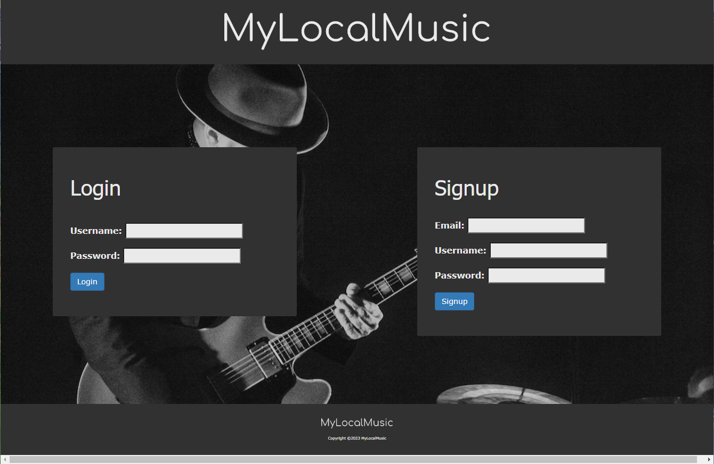

# MyLocalMusic

## Table of Contents
1. [Description](#description)
2. [Installation](#installation)
3. [Testing](#testing)
4. [Contribution](#contribution)
5. [Mock-Up](#mock-Up)
6. [Application](#application)
7. [License](#license)
8. [Contact](#contact)

## Description
Streaming services today have made it easier than ever to listen to music from all around the world, but with unlimited access to artists, finding and supporting local bands has become more difficult. With Austin being the music capital of the world, MyLocalMusic strives to connect Austinites with local bands and allowing the user to save artists that they have seen live.

## Installation
Install dependencies using ``` npm i ``` and make sure to enter in user credentials in the  ``` .env ``` file. Source and seed the database by running the ``` schema.sql ``` file and ``` seeds/index.js ```. Finally, run ``` npm start ``` to begin the server.

## Testing
No tests written for this project!

## Contribution
Currently not accepting contributions to the repo.


## Mock-Up
()

## License
Please see https://mit-license.org/ to get info about this license


## Contact
GitHub: https://www.github.com/HLovelady
GitHub: https://www.github.com/marcielucke
GitHub: https://www.github.com/jsadowski7